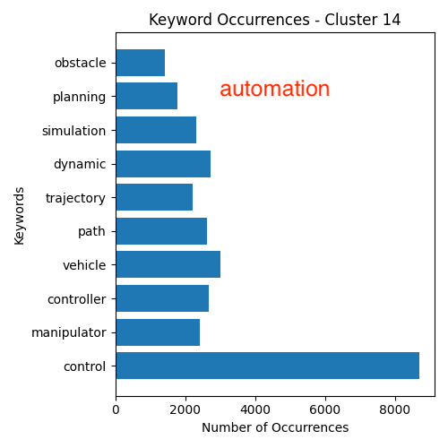

# Result produced by GMM on 50k dataset

Mainly discuss the result below:

- Documents distribution of clusters produced by four models

- Keywords occurrences of  the common clusters(which keywords contribute to the cluster)

As the dataset gets larger. (From 1K -> 10K -> 50K), I found:

- The distribution(the number or articles in each clusters) is getting more evenly

- The cluster make more sense. Only one cluster produces no sense now

  

## Cluster distribution

## Keywords occurrences

)